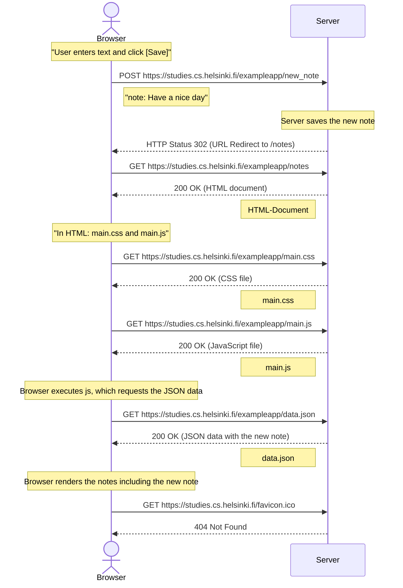

```mermaid
sequenceDiagram
    actor Browser
    participant Server

    Note over Browser: "User enters text and click [Save]"

    Browser->>Server: POST https://studies.cs.helsinki.fi/exampleapp/new_note
    Note right of Browser: "note: Have a nice day"
    Note over Server: Server saves the new note
    Server-->>Browser: HTTP Status 302 (URL Redirect to /notes)

    Browser->>Server: GET https://studies.cs.helsinki.fi/exampleapp/notes
    Server-->>Browser: 200 OK (HTML document)
    Note left of Server: HTML-Document

    Note over Browser: "In HTML: main.css and main.js"
    Browser->>Server: GET https://studies.cs.helsinki.fi/exampleapp/main.css
    Server-->>Browser: 200 OK (CSS file)
    Note left of Server: main.css

    Browser->>Server: GET https://studies.cs.helsinki.fi/exampleapp/main.js
    Server-->>Browser: 200 OK (JavaScript file)
    Note left of Server: main.js

    Note over Browser: Browser executes js, which requests the JSON data

    Browser->>Server: GET https://studies.cs.helsinki.fi/exampleapp/data.json
    Server-->>Browser: 200 OK (JSON data with the new note)
    Note left of Server: data.json

    Note over Browser: Browser renders the notes including the new note

    Browser->>Server: GET https://studies.cs.helsinki.fi/favicon.ico
    Server-->>Browser: 404 Not Found
```
