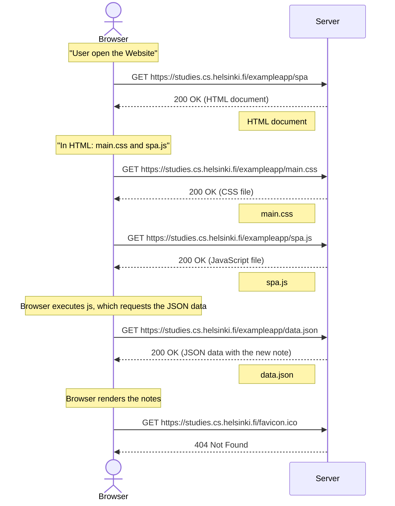

```mermaid
sequenceDiagram
    actor Browser
    participant Server

    Note over Browser: "User open the Website"
    Browser->>Server: GET https://studies.cs.helsinki.fi/exampleapp/spa
    Server-->>Browser: 200 OK (HTML document)
    Note left of Server: HTML document

    Note over Browser: "In HTML: main.css and spa.js"
    Browser->>Server: GET https://studies.cs.helsinki.fi/exampleapp/main.css
    Server-->>Browser: 200 OK (CSS file)
    Note left of Server: main.css

    Browser->>Server: GET https://studies.cs.helsinki.fi/exampleapp/spa.js
    Server-->>Browser: 200 OK (JavaScript file)
    Note left of Server: spa.js

    Note over Browser: Browser executes js, which requests the JSON data

    Browser->>Server: GET https://studies.cs.helsinki.fi/exampleapp/data.json
    Server-->>Browser: 200 OK (JSON data with the new note)
    Note left of Server: data.json

    Note over Browser: Browser renders the notes

    Browser->>Server: GET https://studies.cs.helsinki.fi/favicon.ico
    Server-->>Browser: 404 Not Found
```
