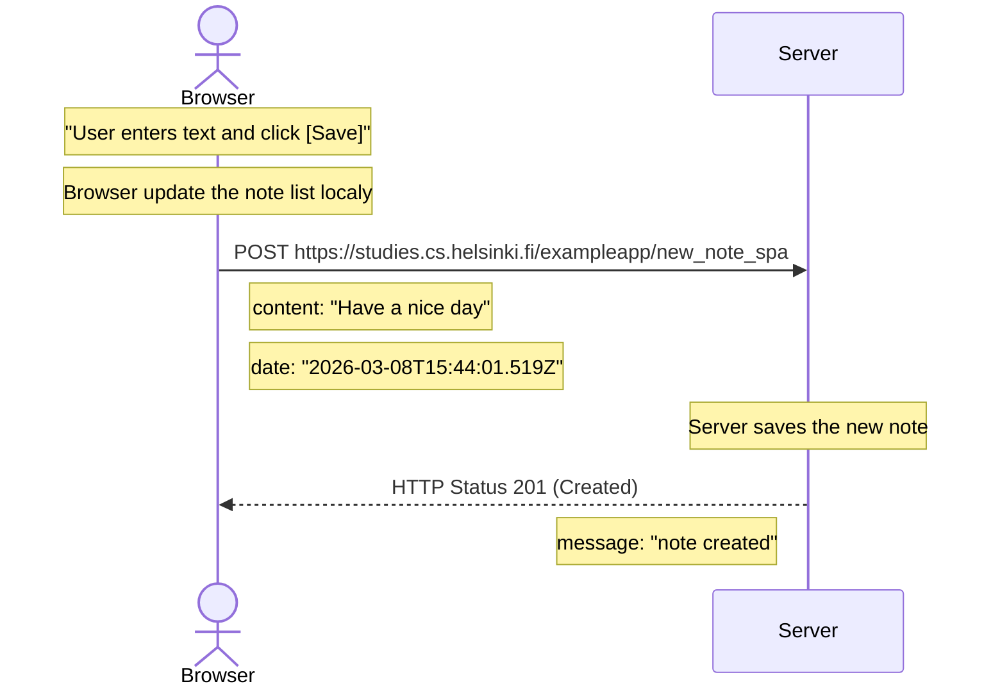

```mermaid
sequenceDiagram
    actor Browser
    participant Server

    Note over Browser: "User enters text and click [Save]"
    Note over Browser: Browser update the note list localy

    Browser->>Server: POST 	https://studies.cs.helsinki.fi/exampleapp/new_note_spa
    Note right of Browser: content: "Have a nice day"
    Note right of Browser: date: "2026-03-08T15:44:01.519Z"
    Note over Server: Server saves the new note
    Server-->>Browser: HTTP Status 201 (Created)
    Note left of Server: message: "note created"

```
